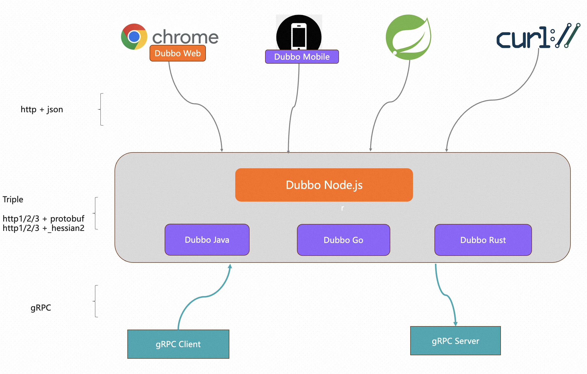

# Apache Dubbo for ECMAScript

[](https://github.com/apache/dubbo-js/blob/dubbo3/.github/workflows/node.js.yml)

Apache Dubbo is an easy-to-use Web and RPC framework that provides different
language implementations([Java](https://github.com/apache/dubbo), [Go](https://github.com/apache/dubbo-go), [Rust](https://github.com/apache/dubbo-rust), Node.js, Javascript) for communication, service discovery, traffic management,
observability, security, tools, and best practices for building enterprise-ready microservices.

Dubbo-js is the TypeScript implementation of [Dubbo triple protocol (a fully gRPC compatible and http friendly protocol)](https://dubbo.apache.org/zh-cn/overview/reference/protocols/triple-spec/), which can be used for Node.js and web application development. With dubbo-js, you can easily build applications working on browser and frontend that can communicate with backend services through http-based protocol.



* [Node.js Documentation](https://github.com/apache/dubbo-js/blob/dubbo3/example/dubbo-node-example)
* [Web Documentation](https://github.com/apache/dubbo-js/blob/dubbo3/example/dubbo-web-example)

## Get Started
The following two demos will guide you on how to create Node.js backend and web applications using dubbo-js.

You can call backend Dubbo services with type-safe APIs:

```typescript
const resp = await client.say({sentence: "Hello, Dubbo."});
console.log(resp);
```

Or, you can curl them if you want:

```shell
curl \
 --header 'Content-Type: application/json' \
 --data '{"sentence": "Hello World"}' \
 http://localhost:8080/apache.dubbo.demo.example.v1.ExampleService/Say
```

### Get started on the web
Follow this [guide]() to learn how to develop web applications that can access backend Dubbo services and running on browser.

We support all modern web browsers that implement the widely available fetch API and the Encoding API.

### Get started on Node.js

Follow this [guide](./example/dubbo-node-example/) here to learn how to develop and spin up a backend Dubbo service in Node.js, and call it from cURL, the web browser, or a Dubbo client in your terminal.

In addition, Dubbo integrates middlewares such as express, fastify, and next, making it easier for users to build a Dubbo distributed service framework using Node.js.

## Service Governance features
Besides rpc protocol, we plan to provide dubbo-js rich service governance features so it can work seamlessly with other microservice architecture. 

The features listed below are still under development, we will update each feature's status once ready.

- :construction: **Service Discovery**:

 Nacos, Zookeeper, Kubernetes, etc.

- :construction: **Load Balance**:

 Random, RoundRobin, LeastActive, ConsistentHash, etc.

- :construction: **Traffic Routing**:
 Traffic split, Circuit breaking, Canary release, etc.

- :construction: **Filter**:
 Token, AccessLog, Rate limiting, etc.

- :construction: **Metrics**:
  Prometheus

- :construction: **Tracing**:
  Jaeger, Zipkin

## How to contribute

Please check [CONTRIBUTING](./CONTRIBUTING.md) for how to contribute to this project.

## Connect us

Search Dingding group number and join us: 27690019068

## Credit

This project is based on [bufbuild/connect-es](https://github.com/bufbuild/connect-es), an open-source project released under Apache License v2. Comparing to connect-es, dubbo-js removed the unused grpc-web and connect protocol, added support for Dubbo protocol, no-idl programming api and many service governance features. 

We have a announcement in our LICENSE file and keep all license headers of files come from connect-es unchanged.
