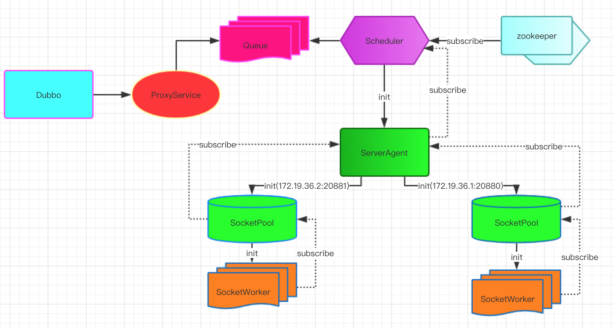

# Apache Dubbo-js

Dubbo-js, using Node.js to embrace the Dubbo ecosystem. See this [Demo](https://github.com/apache/dubbo-js) to find how intelligent this project is.

## Features

- Various transport protocols (Hessian, JSON-RPC etc.) supports
- Tracing (Runtime information, Call Stack)
- Multiple registry centers (Zookeeper, Nacos, Redis) supports or connecting to services directly
- Extensibility, inspired from Koa Middleware
- Builtin reconnection strategy
- Typescript type definitions
- Tools to automatically translate Java interfaces to Typescript type definitions
- Dubbox supports

## Architecture



## Getting Started

```
yarn add dubbo-js
```

## Usage

Below code snippet shows how to work with the typescript type definitions which automatically translated from Java interfaces.

```typescript
// ===================== service.ts ==================
// generated by interpret tools
import {BasicTypeProvider} from './providers/org/apache/dubbo/demo/BasicTypeProvider';
import {DemoProvider} from './providers/org/apache/dubbo/demo/DemoProvider';
import {ErrorProvider} from './providers/org/apache/dubbo/demo/ErrorProvider';

export default {
  BasicTypeProvider,
  DemoProvider,
  ErrorProvider,
};

// =============== dubbo.ts ========================
import {Dubbo} from 'dubbo-js';
import service from './service';

// create dubbo object
const dubbo = new Dubbo<typeof service>({
  application: {name: 'dubbo-js'},
  // zookeeper address
  register: 'localhost:2181',
  service,
});

// main method
(async () => {
  let {res, err} = await dubbo.service.DemoProvider.sayHello('node');
  // print {err: null, res:'hello node from dubbo service'}
  ({res, err} = await dubbo.service.DemoProvider.echo());
  // print {err: null, res: 'pang'}
  ({res, err} = await dubbo.service.DemoProvider.getUserInfo());
  // print {status: 'ok', info: { id: '1', name: 'test' }, err: null}
})();
```

The automatically translated typescript type definitions are not necessary, below code snippet demonstrates how to use dubbo-js without them.

```typescript
// create the service to be injected
import {Dubbo} from 'dubbo-js';

const demoProvider = dubbo =>
  dubbo.proxyService({
    dubboInterface: 'org.apache.dubbo.demo.DemoProvider',
    version: '1.0.0',
    methods: {
      sayHello(name) {
        return [java.String(name)];
      },

      echo() {},

      test() {},

      getUserInfo() {
        return [
          java.combine('org.apache.dubbo.demo.UserRequest', {
            id: 1,
            name: 'nodejs',
            email: 'node@test.com',
          }),
        ];
      },
    },
  });

// integrate the service in demoProvider with dubbo object constructor
const service = {
  demoProvider,
};

const dubbo = new Dubbo<typeof service>({
  // ....other parameters
  service,
});
```

## How to run a quick starter?

**Make sure java, maven, docker, Node, Yarn is installed locally.**
If you'd like to contribute, it's a good start to follow below commands to get a locally runnable project.

```sh
# cd root dir
cd dubbo-js

# start java dubbo service
chmod 755 ./start_dubbo_service.sh
sh ./start_dubbo_service.sh

# build package module
make

# start node
cd example/hello-koa
# install node modules
yarn
# start web
yarn run debug:start
# test /hello
curl http://localhost:3000/hello

# or hello-egg example
cd example/hello-egg
yarn
yarn run dev
# test /hello
http://127.0.0.1:7001/hello
```

## How to run all tests

```sh
cd dubbo-js
sh ./start_dubbo_service.sh
yarn
make
yarn run test
```

## How to build dubbo-js module

```sh
git clone https://github.com/apache/dubbo-js.git
cd dubbo-js
npm install -g lerna
lerna bootstrap
make build-dubbo
```

## Next steps

[Guides](/docs/README.md)

## Reporting bugs

Please follow the [template](https://github.com/apache/dubbo-js/issues/new?template=bug_report.md) for reporting any issues.

## Knowledge Sharing

[2019-meetup](https://github.com/dubbo/awesome-dubbo/blob/master/slides/meetup/201903%40nanjing/Dubbo2.js-from-0-to-1.pdf) by [hufeng](https://github.com/hufeng)

## Thanks

Dubbo-js will not work without:

- [js-to-java](https://github.com/node-modules/js-to-java)
- [hessian.js](https://github.com/node-modules/hessian.js)

Many thanks to their authors [fengmk2](https://github.com/fengmk2) and [dead-horse](https://github.com/dead-horse).

## License

Apache Dubbo is under the Apache 2.0 license. See the [LICENSE](/LICENSE) file for details.
