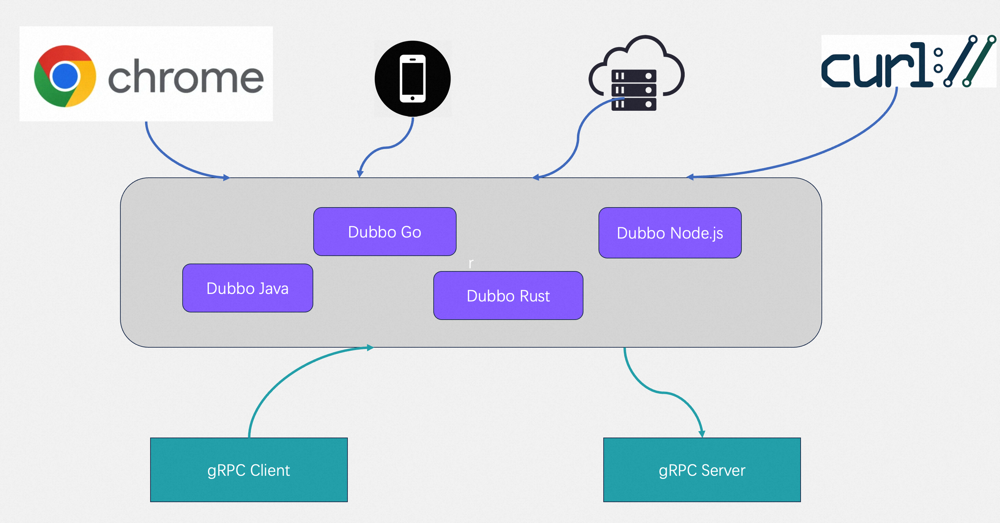

# Getting started

## What is Dubbo-js
Dubbo-js is the TypeScript implementation of [Dubbo triple protocol (a fully gRPC compatible and http friendly protocol)](https://dubbo.apach.org/zh-cn/overview/reference/protocols/triple-spec/), which can be used for Node.js and web application development. With dubbo-js, you can easily build applications working on browser and frontend that can communicate with backend services through http-based protocol.



## Prerequisites

- Have the latest version of Node.js installed.
- Operate a server that employs the Dubbo ecosystem and provides interfaces.
- Install the necessary dependencies:

```shell
  npm install @apachedubbo/dubbo @apachedubbo/dubbo-web
```

## Usage

There are two modes for using Dubbo-js in the frontend, primarily differing based on whether or not an IDL has been generated.

### Without an existing IDL

In scenarios where no IDL is available, the first step involves defining a service using Proto:

```Shell
mkdir -p src/util/proto && touch src/util/proto/example.proto
```

Subsequently, populate it with content:

```Protobuf
syntax = "proto3";

package apache.dubbo.demo.example.v1;

message SayRequest {
  string sentence = 1;
}

message SayResponse {
  string sentence = 1;
}

service ExampleService {
  rpc Say(SayRequest) returns (SayResponse) {}
}
```

This file declares a service named `ExampleService` and defines its `Say` method along with its request parameter `SayRequest` and response parameter `SayResponse`.

Before generating code, ensure that you have **globally** installed the required dependencie

```shell
npm install -g @bufbuild/protoc-gen-es  @apachedubbo/protoc-gen-apache-dubbo-es
```

After installing these dependencies, execute the following commands to generate the code：
> Note: Replace the relative paths in the command according to your actual setup.

```Shell
  protoc -I src/util/proto \
  --es_out src/util/gen \
  --es_opt target=ts \
  --apache-dubbo-es_out src/util/gen \
  --apache-dubbo-es_opt target=ts \
  example.proto
```

Upon completion, you should find the `example_dubbo.ts` and `example_pb.ts` files in the specified output location.

The final step is incorporating them into your frontend project. Below is an example using a React app：

```typescript
import { useState } from "react";
import "./App.css";

import { createPromiseClient } from "@apachedubbo/dubbo";
import { createDubboTransport } from "@apachedubbo/dubbo-web";

// Import service definition that you want to connect to.
import { ExampleService } from "./util/gen/example_dubbo";

// The transport defines what type of endpoint we're hitting.
// In our example we'll be communicating with a Dubbo endpoint.
const transport = createDubboTransport({
  baseUrl: "http://localhost:8080",
});

// Here we make the client itself, combining the service
// definition with the transport.
const client = createPromiseClient(ExampleService, transport, { serviceGroup: 'dubbo', serviceVersion: '1.0.0' });

function App() {
  const [inputValue, setInputValue] = useState("");
  const [messages, setMessages] = useState<
    {
      fromMe: boolean;
      message: string;
    }[]
  >([]);
  return (
    <>
      <ol>
        {messages.map((msg, index) => (
          <li key={index}>{`${msg.fromMe ? "ME:" : "Dubbo Server:"} ${msg.message}`}</li>
        ))}
      </ol>
      <form
        onSubmit={async (e) => {
          e.preventDefault();
          // Clear inputValue since the user has submitted.
          setInputValue("");
          // Store the inputValue in the chain of messages and
          // mark this message as coming from "me"
          setMessages((prev) => [
            ...prev,
            {
              fromMe: true,
              message: inputValue,
            },
          ]);
          const response = await client.say({
            sentence: inputValue,
          });
          setMessages((prev) => [
            ...prev,
            {
              fromMe: false,
              message: response.sentence,
            },
          ]);
        }}
      >
        <input value={inputValue} onChange={(e) => setInputValue(e.target.value)} />
        <button type="submit">Send</button>
      </form>
    </>
  );
}

export default App;
```

### When an IDL already exists

In this case, most of the code remains similar to the previous example, except when an IDL is provided, it supplies the information needed to invoke the service directly:

```typescript
// set backend server to connect
// replace with your own backend server url
const transport = createDubboTransport({
  baseUrl: "http://localhost:8080",
});
// init client
const client = createPromiseClient(transport);

function App() {
  // ...
  // call remote Dubbo service
  const response = await client.call(
    "apache.dubbo.demo.example.v1.ExampleService",
    "say",
    {
      sentence: inputValue,
    });
}
```

## Next action

As you progress, creating a server-side application component becomes a crucial step in fleshing out a complete microservices architecture. For further details on this section, please refer to [the documentation](/#todo)
